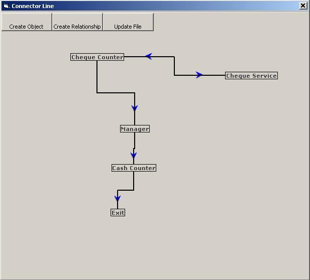



## Objects Connector \( Movable\)

### Description

I have just updated the code which was submitted by Senthamil , now its totally dynamic. Means user can create lalbels at run time and make relationships at run time. now this code is totally dynamic and its working very fine and now it meets my requirement. Normally it can be use to design service architecture.
 
### More Info
 

             |
---                |---
**Submitted On**   |2006-12-23 17:58:36
**By**             |[M Abbas](https://github.com/Planet-Source-Code/PSCIndex/blob/master/ByAuthor/m-abbas.md)
**Level**          |Advanced
**User Rating**    |4.5 (18 globes from 4 users)
**Compatibility**  |VB 6\.0
**Category**       |[VB function enhancement](https://github.com/Planet-Source-Code/PSCIndex/blob/master/ByCategory/vb-function-enhancement__1-25.md)
**World**          |[Visual Basic](https://github.com/Planet-Source-Code/PSCIndex/blob/master/ByWorld/visual-basic.md)
**Archive File**   |[Objects\_Co20393012262006\.zip](https://github.com/Planet-Source-Code/m-abbas-objects-connector-movable__1-67469/archive/master.zip)

